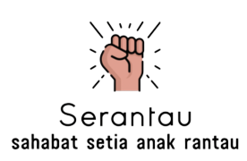

# Serantau - Sahabat Setia Anak Rantau

## About
Serantau is a smartphone-based food delivery service provider application aimed at 'overseas children' in Indonesia. There are so many problems that overseas children complain about in Indonesia, one of which is the fulfillment of food needs. Overseas children are often lazy to find food, eat dangerous foods, and are malnourished. Therefore, Serantau is here to solve this problem by providing healthy and nutritious catering food.

This repository is Serantau Android application that build using Kotlin. 

## Features

Currently Serantau has 2 main features those are
#### Catering
The feature where "Rantauers" or overseas person to order food regularly. 
How do user order catering ?
- Login with their respective account or register if dont have it
- Go to catering menu
- Choose the desired menu to order
- Fill order information (time delivery (08.00, 13.00, 17.00), address, order start date and order end date, notes)
- In "riwayat" tab, click on item with "pembayaran" status, and upload proof of payment. Maximum h-1 of order start date
- Wait verification by Serantau Team and will notify if its already done
- Enjoy food

#### Scan food nutrition
Feature to display the nutrition of the food. This feature takes advantage of machine learning in its implementation.
- Login with their respective account or register if dont have it
- Go to catering menu
- Open "scanning" tab
- Click the button to open camera
- Put camera in front of the  food you want to know the nutrition
- Preview the result and click the "upload photo" button
- Wait for the result and after all done Serantau will show list of food in the photo with its nutrition 

## Permissions & Requirements

### Permissions 
- Camera
- Internet
- Coarse location
- Fine location

### Requirements
- Tools : Android Studio
- Kotlin
- Gradle ^7.1.3
- JVM
- MinSDK 26
- Target SDK 32

## Dependencies
- Android core ktx
- Livedata-ktx and LiveModel-ktx
- Material design
- Retrofit (Manage API)
- Picasso (for image purpose)
- de.hdohenof (Image circle)
- com.github.denzcoskun:ImageSlideshow (image slider)
- Camerax
- com.ismaeldivita.chipnavigation (bottom navigation)

## Screenshot

    

    

    

    

    

## Contributing
Serantau is a free and open source project so far. Any contributions are welcome. Here are a few ways you can help:
 * Report bugs and make suggestions
 * Translate the app
 * Write some code. Please follow the code style used in the project to make a review process faster.
